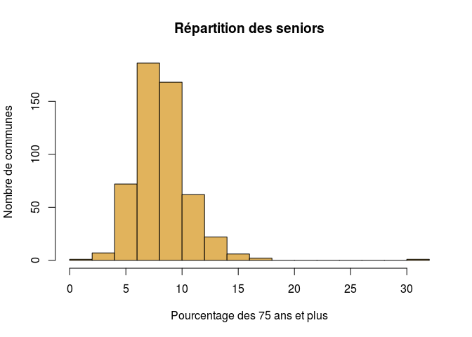
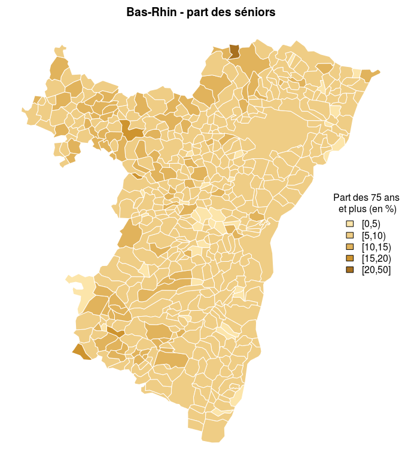
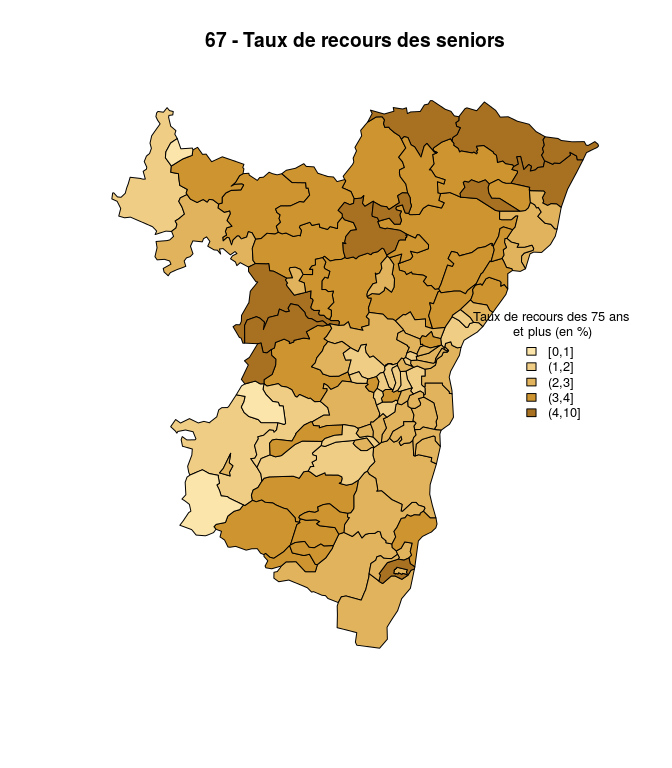
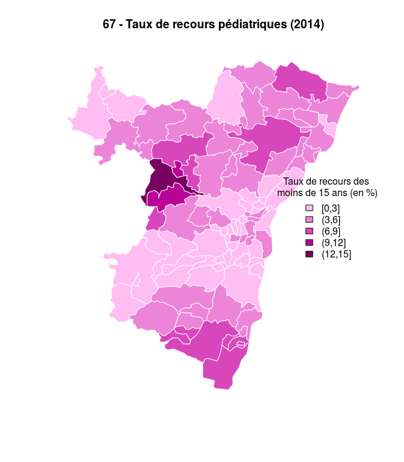
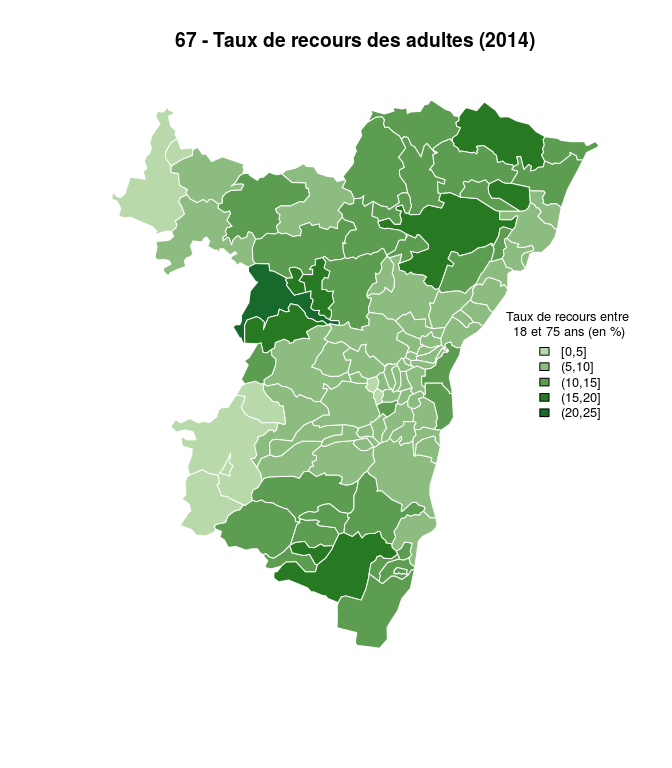
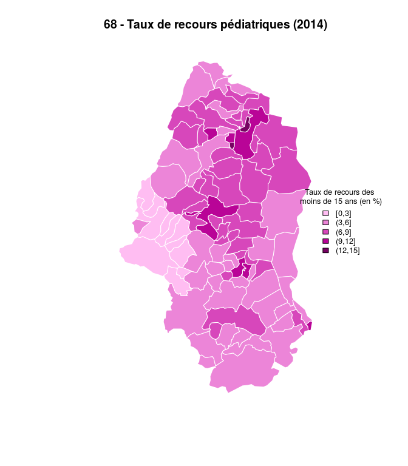
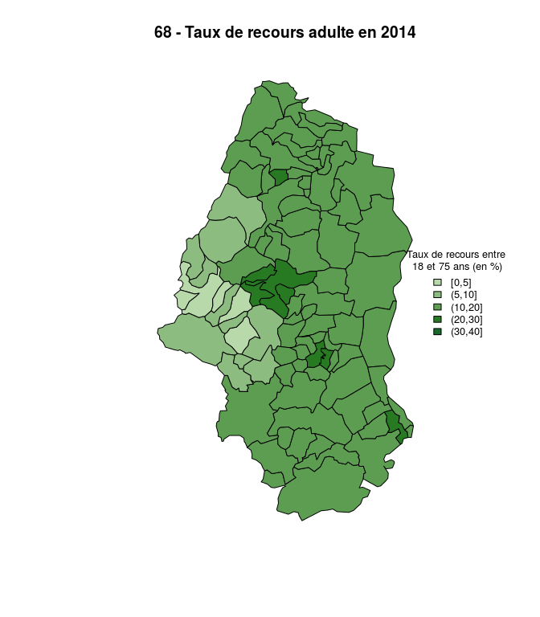

# INSEE
JcB  
13/10/2075  

L'INSEE fournit le fichier rp19682011_individus_dbase/rp19682011.dbf au format DBase

Fichier Population par Communes et par sexe
===========================================

Dernier fichier remonte au recensement 2012 avec une mise à jour le 25 juin 2075. Difficile à trouver sur le site de l'INSEE: 
```
Accueil > Thèmes > Population > Évolution et structure de la population 

- choisir le premier item: Démarrer votre recherche
- cocher __Données détaillées : bases de données téléchargeables__
- OK
- chercher le lien: Base de tableaux détaillés : population et lieu de résidence antérieur à 2012
- BD: __POP1B : population par sexe et âge__. Le fichier fait plus de 7 millions de lignes
```

Chargemet du fichier
--------------------

Comme souvent dans l'administration française, le format utilisé est windows latin1... Le fichier est très volumineux (283 Mb)

```{}
file <- "INSEE/Population_Sexe_Commune_2013/BTT_TD_POP1B_2012.txt"
d <- read.csv2(file, encoding = "latin1")
head(d)
```

On ne garde que les données de la zone Alsace-Lorraine
------------------------------------------------------

Le fichier créé pour le 67 comporte 106.454 lignes et 6 colonnes. Il correspond aux 527 communes fois 100 classes d'age (0-100 ans) fois 2 classes (H et F). Chaque commune est caractérisée par son nom et son code INSEE.

metadata:

- "NIVGEO"  com = commune, ARM arrondissement (Paris, Marseille)
- "CODGEO"  code INSEE
- "LIBGEO"  nom de la commune
- "SEXE"    1 = Homme, 2 = Femme
- "AGED100" age en années de 0 à 100 ans (Age 000 = moins de 1 an)
- "NB"      nombre de personnes dans la catégorie d'age et de sexe

La fonction __str_detect()__ retourne TRUE si l'élément du vecteur _d$CODGEO_ contient le gabarit p.


```r
# Bas-Rhin
p <- "^67"
pop67.2012 <- d[str_detect(d$CODGEO, p) == TRUE,]
save(pop67.2012, file = "INSEE/Population_Sexe_Commune_2013/pop67_2012.Rda")

# Haut-Rhin
p <- "^68"
pop68.2012 <- d[str_detect(d$CODGEO, p) == TRUE,]
save(pop68.2012, file = "INSEE/Population_Sexe_Commune_2013/pop68_2012.Rda")

# Moselle
p <- "^57"
pop57.2012 <- d[str_detect(d$CODGEO, p) == TRUE,]
save(pop57.2012, file = "INSEE/Population_Sexe_Commune_2013/pop57_2012.Rda")

# Meurthe et Moselle
p <- "^54"
pop54.2012 <- d[str_detect(d$CODGEO, p) == TRUE,]
save(pop54.2012, file = "INSEE/Population_Sexe_Commune_2013/pop54_2012.Rda")

# Vosges
p <- "^88"
pop88.2012 <- d[str_detect(d$CODGEO, p) == TRUE,]
save(pop88.2012, file = "INSEE/Population_Sexe_Commune_2013/pop88_2012.Rda")

# Meuse
p <- "^55"
pop55.2012 <- d[str_detect(d$CODGEO, p) == TRUE,]
save(pop55.2012, file = "INSEE/Population_Sexe_Commune_2013/pop55_2012.Rda")
```

Exploitation des données
------------------------

```r
library(stringr)

load("Population_Sexe_Commune_2013/pop67_2012.Rda")
# en mode console:
# load("INSEE/Population_Sexe_Commune_2013/pop67_2012.Rda")

# population totale du 67
n.pop67.2012 <- sum(pop67.2012$NB)

# population par commune. La commune est repérée par son code INSEE
pop.com.67 <- tapply(pop67.2012$NB, factor(pop67.2012$CODGEO), sum)
head(pop.com.67)
```

```
## 67001 67002 67003 67004 67005 67006 
##  2043   408   467   526   824   214
```

```r
# population par commune et par sexe
pop.com.67.sexe <- tapply(pop67.2012$NB, list(factor(pop67.2012$CODGEO), pop67.2012$SEXE), sum)
colnames(pop.com.67.sexe) <- c("H","F")

head(pop.com.67.sexe)
```

```
##               H         F
## 67001 1019.0000 1024.0000
## 67002  194.6327  213.3673
## 67003  243.4362  223.5638
## 67004  270.3738  255.6262
## 67005  425.8769  398.1231
## 67006  103.9429  110.0571
```

```r
head(pop.com.67.sexe[,"H"])
```

```
##     67001     67002     67003     67004     67005     67006 
## 1019.0000  194.6327  243.4362  270.3738  425.8769  103.9429
```

```r
head(pop.com.67.sexe[,2])
```

```
##     67001     67002     67003     67004     67005     67006 
## 1024.0000  213.3673  223.5638  255.6262  398.1231  110.0571
```

```r
# population de 75 ans et plus par commune
pop75 <- pop67.2012[pop67.2012$AGED100 > 74,]
pop75.com.67 <- tapply(pop75$NB, factor(pop75$CODGEO), sum)
head(pop75.com.67)
```

```
##     67001     67002     67003     67004     67005     67006 
## 147.00000  52.04082  42.72553  51.12523  68.90592  26.49524
```

```r
# population de 75 ans et plus par commune et par sexe
pop75.com.67.sexe <- tapply(pop75$NB, list(factor(pop75$CODGEO), pop75$SEXE), sum)
colnames(pop75.com.67.sexe) <- c("H","F")

head(pop75.com.67.sexe)
```

```
##               H        F
## 67001 64.000000 83.00000
## 67002 19.775510 32.26531
## 67003 18.878723 23.84681
## 67004 23.596262 27.52897
## 67005 29.667828 39.23810
## 67006  7.133333 19.36190
```

```r
# création d'un dataframe avec nom commune, code commune, pop totale par commune, les 75 ans et plus, le pourcentage
a <- data.frame(unique(pop67.2012$LIBGEO), unique(pop67.2012$CODGEO), pop.com.67, pop.com.67.sexe[,"H"], pop.com.67.sexe[,"F"], pop75.com.67, pop75.com.67.sexe[,"H"], pop75.com.67.sexe[,"F"],  pop75.com.67 * 100 / pop.com.67)
names(a) <- c("LIBGEO","CODGEO","POP67","H67","F67","POP67_75","POP67_75H","POP67_75F", "p75")
head(a)
```

```
##             LIBGEO CODGEO POP67       H67       F67  POP67_75 POP67_75H
## 67001    Achenheim  67001  2043 1019.0000 1024.0000 147.00000 64.000000
## 67002  Adamswiller  67002   408  194.6327  213.3673  52.04082 19.775510
## 67003         Albé  67003   467  243.4362  223.5638  42.72553 18.878723
## 67004  Allenwiller  67004   526  270.3738  255.6262  51.12523 23.596262
## 67005 Alteckendorf  67005   824  425.8769  398.1231  68.90592 29.667828
## 67006    Altenheim  67006   214  103.9429  110.0571  26.49524  7.133333
##       POP67_75F       p75
## 67001  83.00000  7.195301
## 67002  32.26531 12.755102
## 67003  23.84681  9.148936
## 67004  27.52897  9.719626
## 67005  39.23810  8.362369
## 67006  19.36190 12.380952
```

```r
summary(a$p75)
```

```
##    Min. 1st Qu.  Median    Mean 3rd Qu.    Max. 
##   0.000   6.680   7.980   8.181   9.344  30.490
```

```r
hist(a$p75, col = "#E1B35C", ylab = "Nombre de communes", xlab = "Pourcentage des 75 ans et plus", main = "Répartition des seniors")

# communes aberantes
a[which(a$p75 > 30),]
```

```
##                LIBGEO CODGEO POP67      H67      F67 POP67_75 POP67_75H
## 67334 Niedersteinbach  67334   143 72.55748 70.44252 43.60727  16.77203
##       POP67_75F     p75
## 67334  26.83525 30.4946
```

```r
a[which(a$p75 == 0),]
```

```
##            LIBGEO CODGEO POP67 H67 F67 POP67_75 POP67_75H POP67_75F p75
## 67050 Blancherupt  67050    38  18  20        0         0         0   0
```

```r
# On discrétise la colonne des % en 5 groupes de 5%
a$cut <- cut(a$p75, breaks = c(0,5,10,15,20,50), include.lowest = TRUE, right = FALSE)

# et on transforme en classes numériques (servira pour colorier la carte)
a$cut2 <- as.numeric(a$cut)

# couleurs
library("cartography")
```

```
## Loading required package: sp
```

 

```r
cols <- carto.pal("sand.pal", 5)
```

Dessinner une carte
-------------------


```r
# carte des communes du 67
load("~/Documents/Resural/Stat Resural/RPU_Doc/RPU_Carto-Pop-Alsace/Cartographie/Cartofile/carto67.Rda")

# fonction attribJoin
source('~/Documents/Resural/FEDORU/Trame_Commune/Zone_chalandise/zone_chalandise.R')

library("cartography")
cols <- carto.pal("sand.pal", 5)

# on crée un nouveau dataframe en combinant la table attributaire du fichier SHP des communes du bas-rhin avec les données du bas-rhin. La fonction attrJoin permet de ne pas perdre l'ordre des communes et pa là le lien avec le dessin des contours.
d67.p75 <- attribJoin(a, st, "CODGEO", "INSEE_COM" )

par(mar = c(0,0,2,0))
plot(d67.p75, col = cols[as.numeric(as.factor(d67.p75$cut2))], main = "Bas-Rhin - part des séniors", border = "white")
# legend("right", legend = levels(d67.p75$cut), col = cols, pch = 15, bty = "n", title = "Part des 75 ans\n et plus (en %)")
legend("right", legend = levels(d67.p75$cut), fill = cols, bty = "n", title = "Part des 75 ans\n et plus (en %)")
```

 

```r
# données INSEE recensement 2012
```

Carte du taux de recours (75 ans et plus)
-----------------------------------------

Il faut la carte par codes postaux car le RPU ne connait que les dodes postaux(CP) et le nom de la commune est aléatoire. On utilise le fichier __cp67__ qui dessine la carte des CP. Inconvénient, la population communale est celle du recensement de 2010. Voir comment la mettre à jour. Il existe une table de conversion publiée par [Open Data](http://public.opendatasoft.com/explore/dataset/correspondance-code-insee-code-postal/table/?tab=table). Le fichier existe sous deux formes: SHP (carte des cp) et CSV. Enregistrés sous _correspondance-code-insee-code-postal_ dans Documents/CartographieR/Fond de carte des codes postaux/.

### En pratique

1. récupérer le fond de carte des codes postaux. Trois fichiers (67, 68, toute l'Alsace)
2. créer le dataframe avec les données à représenter. Ce dataframe doit avoir une colonne avec les codes postaux
3. merger les deux précédents
4. ajouter une colonne de discrétisation
5. ajouter une colonne qui transforme la précédente en niveaux de facteurs.
5. créer un vecteur de dégradé de couleur
6. dessiner la carte


```r
# fond de carte des codes postaux
load("~/Documents/Resural/Stat Resural/RPU_Doc/RPU_Carto-Pop-Alsace/Cartographie/Cartofile/cp67.Rda")
load("~/Documents/Resural/Stat Resural/RPU_Doc/RPU_Carto-Pop-Alsace/Cartographie/Cartofile/cp68.Rda")

# récupérer les données 2014
load("~/Documents/Resural/Stat Resural/RPU_2014/rpu2014d0112_c2.Rda")
# ne garder que la pop du 67 > 74 ans
p <- "^67"
rpu67.75 <- d14[d14$AGE > 74 & str_detect(d14$CODE_POSTAL, p) == TRUE,]

# nb de RPU par code postal
rpu67.75.cp <- tapply(as.Date(rpu67.75$ENTREE), factor(rpu67.75$CODE_POSTAL), length)
b <- data.frame(names(rpu67.75.cp), rpu67.75.cp)

# Merging du fichier carto et des données complémentaires
cp67.p75 <- attribJoin(b, cp67, "names.rpu67.75.cp.", "ID" )

# création des nouvelles colonnes
cp67.p75$p75 <- cp67.p75$rpu67.75.cp * 100 / cp67.p75$POP2010
cp67.p75$cut <- cut(cp67.p75$p75, breaks = c(0,1,2,3,4,10), include.lowest = TRUE)
cp67.p75$cut2 <- as.numeric(cp67.p75$cut)

# affichage de la carte et de la légende
# plot(cp67.p75, col = cols[as.numeric(as.factor(cp67.p75$cut))])
plot(cp67.p75, col = cols[cp67.p75$cut2], main = "67 - Taux de recours des seniors")

legend("right", legend = levels(cp67.p75$cut), fill = cols, bty = "n", title = "Taux de recours des 75 ans\n et plus (en %)", cex = 0.8)
```

 

Taux de recours pédiatrique
---------------------------


```r
p <- "^67"
rpu67.15 <- d14[d14$AGE < 15 & str_detect(d14$CODE_POSTAL, p) == TRUE,]
# nb de RPU par code postal
rpu67.15.cp <- tapply(as.Date(rpu67.15$ENTREE), factor(rpu67.15$CODE_POSTAL), length)
b <- data.frame(names(rpu67.15.cp), rpu67.15.cp)
# Merging du fichier carto et des données complémentaires
cp67.p15 <- attribJoin(b, cp67, "names.rpu67.15.cp.", "ID" )
cp67.p15$p15 <- cp67.p15$rpu67.15.cp * 100 / cp67.p15$POP2010
summary(cp67.p15$p15)
```

```
##    Min. 1st Qu.  Median    Mean 3rd Qu.    Max. 
##  0.4062  2.3340  3.1920  3.7800  4.5710 12.7100
```

```r
cp67.p15$cut <- cut(cp67.p15$p15, breaks = c(0,3,6,9,12,15), include.lowest = TRUE)
cp67.p15$cut2 <- as.numeric(cp67.p15$cut)
display.carto.all (5)
```

 

```r
cols <- carto.pal("pink.pal", 5)
plot(cp67.p15, col = cols[cp67.p15$cut2], main = "67 - Taux de recours pédiatriques (2014)", border = "white")
legend("right", legend = levels(cp67.p15$cut), fill = cols, bty = "n", title = "Taux de recours des\n moins de 15 ans (en %)", cex = 1)
```

 

Taux de recours adulte
----------------------


```r
p <- "^67" # code postal commence par 67
rpu67.18_74 <- d14[d14$AGE > 17 & d14$AGE < 75 & str_detect(d14$CODE_POSTAL, p) == TRUE,]

# nb de RPU par code postal
rpu67.18_74.cp <- tapply(as.Date(rpu67.18_74$ENTREE), factor(rpu67.18_74$CODE_POSTAL), length)
# transformation en dataframe
b <- data.frame(names(rpu67.18_74.cp), rpu67.18_74.cp)

# Merging du fichier carto et des données complémentaires
cp67.p18_74 <- attribJoin(b, cp67, "names.rpu67.18_74.cp.", "ID" )
cp67.p18_74$p18_74 <- cp67.p18_74$rpu67.18_74.cp * 100 / cp67.p18_74$POP2010
summary(cp67.p18_74$p18_74)
```

```
##    Min. 1st Qu.  Median    Mean 3rd Qu.    Max. 
##   2.031   6.689   9.089   9.361  11.900  20.210
```

```r
cp67.p18_74$cut <- cut(cp67.p18_74$p18_74, breaks = c(0,5,10,15,20,25), include.lowest = TRUE)
cp67.p18_74$cut2 <- as.numeric(cp67.p18_74$cut)
# display.carto.all (5) # échantillinnage de couleurs
cols <- carto.pal("green.pal", 5)
plot(cp67.p18_74, col = cols[cp67.p18_74$cut2], main = "67 - Taux de recours des adultes (2014)", border = "white")
legend("right", legend = levels(cp67.p18_74$cut), fill = cols, bty = "n", title = "Taux de recours entre\n 18 et 75 ans (en %)", cex = 0.8)
```

 


Autres départements
===================

Pédiatrie 68
------------


```r
p <- "^68"
rpu68.15 <- d14[d14$AGE < 15 & str_detect(d14$CODE_POSTAL, p) == TRUE,]
# nb de RPU par code postal
rpu68.15.cp <- tapply(as.Date(rpu68.15$ENTREE), factor(rpu68.15$CODE_POSTAL), length)
b <- data.frame(names(rpu68.15.cp), rpu68.15.cp)
# Merging du fichier carto et des données complémentaires
cp68.p15 <- attribJoin(b, cp68, "names.rpu68.15.cp.", "ID" )
cp68.p15$p15 <- cp68.p15$rpu68.15.cp * 100 / cp68.p15$POP2010
summary(cp68.p15$p15)
```

```
##    Min. 1st Qu.  Median    Mean 3rd Qu.    Max. 
##   1.094   4.522   5.869   8.419   7.385 222.800
```

```r
cp68.p15$cut <- cut(cp68.p15$p15, breaks = c(0,3,6,9,12,15), include.lowest = TRUE)
cp68.p15$cut2 <- as.numeric(cp68.p15$cut)
# display.carto.all (5)
cols <- carto.pal("pink.pal", 5)
plot(cp68.p15, col = cols[cp68.p15$cut2], main = "68 - Taux de recours pédiatriques (2014)", border = "white")
legend("right", legend = levels(cp68.p15$cut), fill = cols, bty = "n", title = "Taux de recours des\n moins de 15 ans (en %)", cex = 0.8)
```

 

Adultes 68
----------


```r
p <- "^68"
rpu68.18_75 <- d14[d14$AGE > 17 & d14$AGE < 75 & str_detect(d14$CODE_POSTAL, p) == TRUE,]
cols <- carto.pal("green.pal", 5)
source("carto_recours_cp.R")
carto.recours.cp(rpu68.18_75, rpu68.18_75$CODE_POSTAL, cp68, "ID", cols = cols, titre = "68 - Taux de recours adulte en 2014", legende = "Taux de recours entre\n 18 et 75 ans (en %)")
```

 


Créer un SHP
============
 A partir du fichier __Hopitaux_Alsace.csv__ qui contient la liste des hôpitaux ayant un service d'urgence avec leurs coordonnées WSG84 et Lambert 93, on crée un _SpatialPointDataFrame_ qui est sauvegardé au format _Shapefile_ (SHP).

### Lambert93
```{}
library(rgdal)
library(sp)
hop <- read.csv("~/Documents/Resural/Stat Resural/RPU_Doc/RPU_Carto-Pop-Alsace/Cartographie/Cartofile/Hopitaux_Alsace.csv")
# transformation de hop en SpatialPointDataFrame
coordinates(hop) <- ~LAMB93_X+LAMB93_Y
# Sauvegarde au format SHP
writeOGR(hop, "INSEE/hop_Lambert", "hop_Lamb_shp", driver = "ESRI Shapefile")
plot(hop, pch = 16, col = "red")

# save(hop, file = "~/Documents/Resural/Stat Resural/RPU_Doc/RPU_Carto-Pop-Alsace/Cartographie/Cartofile/Hopitaux_Alsace_Lambert.Rda")
```

### WSG84
```{}
hop <- read.csv("~/Documents/Resural/Stat Resural/RPU_Doc/RPU_Carto-Pop-Alsace/Cartographie/Cartofile/Hopitaux_Alsace.csv")
coordinates(hop) <- ~LAT+LONG
writeOGR(hop, "INSEE/hop_wsg84", "hop_shp", driver = "ESRI Shapefile")
```

